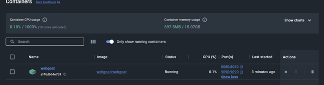

# Persönliches Security Book

**Name, Vorname:**  
Stern Alexander und Camenisch Andri

**Klasse:**  
5IA21b

**Lehrperson:**  
L. Cavuoti

**Abgabetermine:**  
4.7.2024

## Inhaltsverzeichnis

1. [Sicherheitsrisiken vermeiden](#1-sicherheitsrisiken-vermeiden)  
    1.1 [Thema](#11-thema)  
    1.2 [Verbreitung und Erkennung](#12-verbreitung-und-erkennung)  
    1.3 [Problem eindämmen](#13-problem-eindämmen)  
    1.4 [Link](#14-link)  

2. [Verschlüsselungswerkstatt](#2-verschlüsselungswerkstatt)  
    2.1 [Einleitung](#21-einleitung)  
    2.2 [Bcrypt](#22-bcrypt)  
    2.3 [Pfeffer](#23-pfeffer)  

3. [JWT Token](#3-jwt-token)

4. [Spring Security](#4-spring-security)  
    4.1 [Zusammenfassung: Spring Security und Thymeleaf – Login](#41-zusammenfassung-spring-security-und-thymeleaf--login)  
        4.1.1 [Basic Authentication](#411-basic-authentication)  
        4.1.2 [Authentifizierungsprozess](#412-authentifizierungsprozess)  
        4.1.3 [Benutzerdefinierte Authentifizierung](#413-benutzerdefinierte-authentifizierung)  
        4.1.4 [Weitere Komponenten](#414-weitere-komponenten)  
        4.1.5 [Praktische Beispiele](#415-praktische-beispiele)  

5. [Sicherheitsrisiken Maßnahmen](#5-sicherheitsrisiken-massnahmen)  
    5.1 [The Open Source Ecosystems](#51-the-open-source-ecosystems)  
    5.2 [WebGoat](#52-webgoat)  
    5.3 [Knowing the OSS "Bill of Materials" is the starting point](#53-knowing-the-oss-bill-of-materials-is-the-starting-point)  
    5.4 [Security Information Overload](#54-security-information-overload)  
    5.5 [License Information Overload](#55-license-information-overload)  
    5.6 [Architecture Information](#56-architecture-information)  

---

## 1. Sicherheitsrisiken vermeiden

### 1.1 Thema
OWASP 9 : OWASP-9.pptx

Die OWASP Top ten ist eine Liste über die grössten Sicherheitsrisiken im Umfeld der Entwicklung. API9:2023 warnt vor Sicherheitslücken durch unzureichendes Inventarmanagement von APIs. Veraltete Versionen oder ungesicherte Endpunkte erleichtern Angreifern den Zugriff. Das Sicherheitsrisiko bei API9:2023 entsteht aus veralteten API-Versionen oder ungesicherten Endpunkten. Die Bedrohung geht von potenziellen Angreifern aus, die diese Schwachstellen aus-nutzen, um unbefugten Zugriff zu erlangen oder sensible Daten zu kompromittieren.

### 1.2 Verbreitung und Erkennung
Die Verbreitung eines Angriffs aufgrund von unzureichendem Inventarmanagement von APIs kann weitreichend sein, da veraltete Versionen oder ungesicherte Endpunkte potenzielle Angriffsziele darstellen. Angreifer können verschiedene Methoden wie Google Dorking, DNS-Enumeration oder die Nutzung spezialisierter Suchmaschinen für bestimmte Arten von Servern nutzen, um potenzi-elle Ziele zu entdecken. Die Erkennung eines solchen Angriffs kann durch regelmäßiges Monitoring von Netzwerkaktivitä-ten, Identifizierung verdächtiger Zugriffe oder Anomalien im Datenverkehr erfolgen. Eine umfas-sende Inventarisierung und Dokumentation der API-Endpunkte sowie die Implementierung von Sicherheitslösungen zur Überwachung und zum Schutz vor unautorisierten Zugriffen sind ent-scheidend, um solche Angriffe zu erkennen und zu bekämpfen.

### 1.3 Problem eindämmen
- Regelmäßige Aktualisierung und Patching von API-Versionen.
- Starke Authentifizierung und Autorisierung für API-Zugriffe implementieren.
- Regelmäßige Sicherheitsüberprüfungen und Penetrationstests durchführen.
- Zugriff auf API-Hosts beschränken.
- Rate-Limiting-Mechanismen implementieren.
- Mitarbeiter durch Schulungen sensibilisieren.
- Verschlüsselung und sichere Kommunikationsprotokolle verwenden.
- API-Aktivitäten und Datenflüsse überwachen.

Notfallplan für Sicherheitsvorfälle einrichten.

### 1.4 Link
[OWASP API Security](https://owasp.org/API-Security/editions/2023/en/0xa9-improper-inventory-management/)

## 2. Verschlüsselungswerkstatt

### 2.1 Einleitung
Es ist unerlässlich, Passwörter nicht im Klartext zu speichern, da sie bei einer SQL-Injektion leicht gestohlen werden können. Deshalb ist es entscheidend, Passwörter vor dem Speichern zu hashen. Mithilfe einer Hash-Funktion kann eine Zeichenkette so verschleiert werden, dass sie das Passwort nicht mehr offenbart, sondern eine andere Abfolge von Zeichen darstellt. Zum Beispiel würde das Passwort "test", wenn es mit dem Hashing-Algorithmus SHA256 gehasht wird, wie folgt aussehen: 9f86d081884c7d659a2feaa0c55ad015a3bf4f1b2b0b822cd15d6c15b0f00a08. Hashing funktioniert nur in eine Richtung, d.h., aus einem Hash kann das Klartext-Passwort nicht wiederhergestellt werden. Das Problem dabei ist jedoch, dass einfaches Hashen eines Passworts allein nicht aus-reicht, da das Passwort theoretisch mithilfe einer Rainbow-Tabelle wiederhergestellt werden kann. Eine Rainbow-Tabelle ist eine Datenbank, die bekannte Hashes und ihre Klartext-Passwörter ent-hält. Um sich davor zu schützen, muss man sein Passwort salzen, indem man am Ende des Pass-worts eine Zeichenkette hinzufügt. Diese Zeichenkette muss für jedes Passwort unterschiedlich sein, um sicherzustellen, dass keine zwei Passwörter denselben Salt verwenden. Dadurch erhalten Personen mit denselben Passwörtern unterschiedliche Hashes in der Datenbank. Der entsprechen-de Salt jedes Passworts muss jedoch auch in der Datenbank gespeichert werden.

### 2.2 Bcrypt
Bcrypt basiert auf dem Blowfish-Verschlüsselungsalgorithmus und fügt den Passwörtern eine wei-tere Sicherheitsebene hinzu. Dies geschieht, indem Bcrypt viel Rechenzeit benötigt. Diese Re-chenzeit kann durch einen sogenannten Kostenfaktor gesteuert werden. Der Kostenfaktor legt fest, wie oft die Bcrypt-Funktion ausgeführt wird, und wird mit der Basis 2 potenziert. Das bedeu-tet, dass bereits eine Erhöhung des Kostenfaktors um 1 die Berechnungszeit verdoppelt. Hier ist ein Beispiel zur Verdeutlichung von Bcrypt:
Kostenfaktor = 3  
hash = Bcrypt(passwort + salt1)  
hash1 = Bcrypt(hash + neuer salt2)  
hash2 = Bcrypt(hash1 + neuer salt3)

Wie man sieht, wird für jede neue Iteration ein neuer Salt verwendet, was unerlässlich ist. Der hash2 würde dann in einer Datenbank wie folgt gespeichert:  
Algorithmus, Kostenfaktor, Salt, Hashwert  
$2y$3$nOUIs5kJ7naTuTFkBy1veuK0kSxUFXfuaOKdOKf9xYT0KKIGSJwFa

### 2.3 Pfeffer
Das Pfeffern von Passwörtern ähnelt dem Salzen, indem auch hier eine Zeichenkette an das Passwort angehängt wird. Der Unterschied besteht jedoch darin, dass jedes Passwort dieselbe Pfeffer-Zeichenkette verwendet. Es ist wichtig, dass die Pfeffer-Zeichenkette an einem sicheren Ort aufbewahrt wird. Hier ist ein Beispiel für das Pfeffern:  
scharfesPasswort = passwort + Pfeffer-Zeichenkette  
Hash = bcrypt(scharfesPasswort + salt)  

Wenn ein Angreifer Zugang zu einer Datenbank hat, sieht er zwar alle Hashes und die dazugehö-rigen Salts, jedoch bringt ihm das nicht viel. Selbst wenn der Angreifer über eine Rainbow-Tabelle mit allen möglichen Kombinationen verfügt, kann er das Passwort nicht herausfinden, da ihm der Pfeffer fehlt, mit dem das Passwort kombiniert wurde.

## 3. JWT Token
Kurz gesagt kann eine REST-API-Anwendung einen Endpunkt verwenden (z. B. /signup, /register usw.), der von Benutzern, die sich registrieren möchten, ohne Authentifizierung oder Autorisie-rung erreicht werden kann. Die App verwendet auch einen anderen Endpunkt (z. B. /signin, /login, /authenticate usw.). An diesem Endpunkt muss der Benutzer seine Anmeldeinformationen angeben, die eigentlich das Benutzername-Passwort-Paar sind.

## 4. Spring Security

### 4.1 Zusammenfassung: Spring Security und Thymeleaf – Login

#### 4.1.1 Basic Authentication
`httpBasic()` fügt automatisch den BasicAuthenticationFilter zur SecurityFilterChain hinzu. Entfernt man `httpBasic()`, verschwindet dieser Filter.

#### 4.1

.2 Authentifizierungsprozess
BasicAuthenticationFilter: Verarbeitet den Authorization-Header, dekodiert Benutzerdaten und erstellt ein UsernamePasswordAuthenticationToken.  
AuthenticationManager: Authentifiziert das Authentication-Objekt, oft durch ProviderManager, der Anfragen an AuthenticationProvider delegiert.  
AuthenticationProvider: Authentifiziert und gibt bei Erfolg ein Principal-Objekt zurück.

#### 4.1.3 Benutzerdefinierte Authentifizierung
Custom AuthenticationManager: Implementiert eigene Authentifizierungslogik.  
Custom AuthenticationProvider: Implementiert `authenticate()` und `supports()` Methoden für spezifische Authentifizierungsanforderungen.

#### 4.1.4 Weitere Komponenten
UserDetailsService: Überprüft Benutzerinformationen.  
SecurityContext und SecurityContextHolder: Speichern und verwalten das Authentication-Objekt.

#### 4.1.5 Praktische Beispiele
Manuelles Hinzufügen des BasicAuthenticationFilter.  
Erstellung eines globalen AuthenticationManager mit In-Memory-Authentifizierung.  
Implementierung benutzerdefinierter Authentifizierungsmanager und -provider.

## 5. Sicherheitsrisiken Massnahmen

### 5.1 The Open Source Ecosystems
- 10+ Million GitHub code repositories
- 1 Million Sourceforge code repositories
- 2500 public binary repositories
  - Some repositories have strict publisher standards
    - Some repositories enforce source code distribution
    - No guarantee the published source code is the source code of the published binary
  - Some repositories allow the republishing of a different set of bits for the same version
  - Some repositories allow you to remove published artifacts
- Many different packaging systems; even for the same language
- Different coordinates systems and level of granularity

### 5.2 WebGoat
Docker Container läuft.

Auf die WebGoat Applikation habe ich auch Zugriff. Ich werde jetzt die Aufgaben unter A06 machen. WebGoat hatte auch viele Vulnerable Components.  

Diese Aufgabe zeigte, dass das Problem nicht immer in deinem Code ist. Das Problem kann auch in Komponenten oder ähnlichen Sachen liegen.

### 5.3 Knowing the OSS "Bill of Materials" is the starting point
Fast alle Applikation sind heute eine Mischung zwischen custom code und open source code. Der Entwickler weiss sehr viel über seinen eigenen Code aber nicht über die open source Komponenten. Deshalb ist es wichtig, dass der Entwickler gut über die open source Komponenten informiert ist. Diese Fragen sind sehr gut:
- Wie wissen wir, welche Open-Source-Komponenten in unseren Anwendungen enthalten sind?
- Wie wissen wir, welche Versionen der Open-Source-Komponenten wir verwenden?
- Wie definieren wir das Risiko von Open-Source-Komponenten?
- Wie entdecken wir das Risiko von Open-Source-Komponenten?
- Wie ordnen wir ein spezifisches Risiko einer spezifischen Version einer Open-Source-Komponente zu?
- Wie wissen wir, wann eine Komponente eine neue Version veröffentlicht?
- Wie wissen wir, ob eine neue Schwachstelle in einer zuvor "guten" Komponente gefunden wurde?
- Wie wissen wir, ob wir die authentische Version einer Open-Source-Komponente verwenden?

### 5.4 Security Information Overload
Was ist wichtig?
- Ist meine Komponente ausnutzbar?
- Handelt es sich bei meiner Komponente um eine authentische Kopie?
  - Verstehe ich, warum meine Komponente geändert wird?

Sicherheitsinformationen sind überall verstreut:
- Mehrere Quellen für Sicherheitshinweise
  - Über 80.000 CVEs in der National Vulnerbility Database
  - Node Security Project, Metasploit, VulnDB, Snyk, …
  - Tausende Website-Sicherheitshinweise, Blogs, Tweets usw.
- 600.000 täglich generierte GitHub-Ereignisse
  - 700 GitHub-Sicherheitsereignisse
  - Versionshinweise, Änderungsprotokolle, Codekommentare, …

Zusammenfassung:
- Es ist nicht sinnvoll, von einem Entwickler zu erwarten, dass er jede Komponente kontinuierlich erforscht.
- Entwickler sind keine Sicherheitsexperten; Sie haben bereits einen Tagesjob.

### 5.5 License Information Overload
Was ist wichtig?
- Kann ich diese Komponente im Rahmen der Verbreitung meiner Software verwenden?
- Gibt es Lizenzinkompatibilitäten?
- Habe ich bei Verwendung einer geänderten Komponente zusätzliche Lizenzpflichten berücksichtigt?

Lizenzinformationen sind überall verstreut:
- Projekte deklarieren eine Lizenz:
  - In einer Projektmetadatendatei.
  - Auf der Projektwebsite oder der Quellcode-Repository-Seite.
  - Verwendung eines Links zu einer Lizenzdatei in ihrem eigenen Quellcode-Repository.
  - In einer Lizenzdatei im Quellbaum des Projekts.
  - Im binären META-INF-Ordner.
- Projekte enthalten Lizenzen als Header im Quellcode.

Zusammenfassung:
- Es ist schwierig, den Umfang einer Lizenz zu bestimmen.
- Ein Projekt weist häufig Lizenzdiskrepanzen auf.
- Entwickler sind keine Anwälte.

### 5.6 Architecture Information
Was ist wichtig?
- Ist meine Komponente alt oder stabil?
- Ist meine Komponente unbeliebt?
- War mein fehlendes Upgrade eine bewusste Entscheidung oder ein Mangel an Wissen?

Zusammenfassung:
- Es ist wirklich schwierig, Komponenten auf dem neuesten Stand zu halten.

Für die in 25.000 Anwendungen analysierten Komponenten wurde Folgendes festgestellt:
- Für 8 % der 2 Jahre alten Komponenten gab es keine neuere Version
- Für 23 % der 11 Jahre alten Komponenten gab es keine neuere Version
- Ältere Komponenten machen den Großteil des Risikos aus
